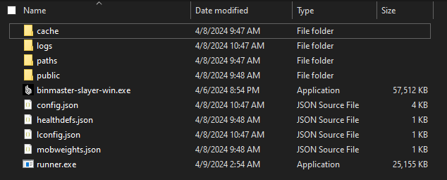
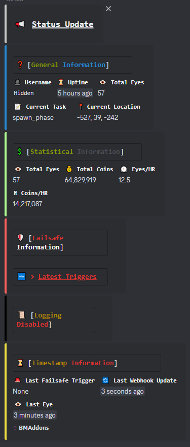
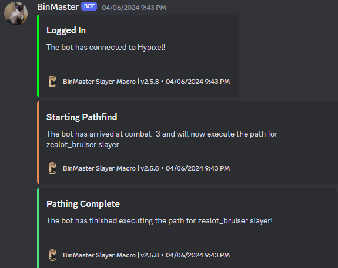

# Full Setup Tutorial/Guide
Follow these steps in order if you don't know how to set this up.

## Downloading 
Head to the `dev` branch's actions, found [here](https://github.com/retcoob/BMAddons/actions) and download the latest successful action.\
Next, download the appropriate operating system build.\
I'm currently on Windows but most steps will be similar on every OS.

## Anti-Virus
If you have an anti-virus installed, in most cases they flag it.\
This is a false positive and the packaging library I use just flags anti-viruses.\
If you cannot or don't want to use pre-compiled executeables for one reason or another, head to the [self-compile documentation](https://github.com/retcoob/BMAddons/docs/compile.md).\
After self-compiling, you may come back here to complete the guide.

## Extraction
Extract the `runner.exe`/`runner.bin` file into the same folder as your `binmaster-slayer` executable.\
It should look something like this:


## Discord Server Setup
Create a new, or use an existing Discord server.\
After doing so, create 2 new text channels.
 - `username-status`
 - `username-webhook`

The `username-status` channel will host your bot's status updates which looks like:
<details><summary>Attached Image</summary>



</details><br><br>

The `username-webhook` channel should host the normal BinMaster activites, which looks like:
<details><summary>Attached Image</summary>



</details><br><br>

Create a webhook in both channels and keep them somewhere safe.\
This will be needed in the next step.

## Runner Configuration
Upon running the executable, you should get something like:\
```? No config file detected! Would you like to run self-setup? (y/N)```\
If you don't see this, or want to manually setup your config, read Manual Config below.

Next, you will see:\
```? Please enter the webhook you would like to use for status updates:```\
Now is the time to use the webhook you saved for `username-status`.\
(right click to paste on Windows)\
A message should be sent. This is normal.

Then, you will have to enter the `username-webhook` that you have also saved earlier.\
```? Please enter the webhook you would like to use for normal webhooks:```\
This should not send a message. So don't be alarmed if you do not see one.

Find the command you use to run BinMaster.\
In most cases, it is either `binmaster-slayer-win.exe` or `./binmaster-slayer-linux.bin`. But you should know this.\
```? Enter the command you use to run BinMaster:```

Next, you will be asked:\
```? Enter your Flask Port:```\
Enter a memorable number as you will need this later.\
For example, mine is set as 8000. You may use this port as well.

You will then be asked:\
```? Enter your 'webpage_port' (this is found in your BinMaster config!):```\
Open your `config.json` (for BinMaster) and enter the `webpage_port`.\
For example, mine is set as 1550. You may use this port as well.\
When you have done this, press `y`.

Now, create a password!\
```? Create a password:```
This password will be used to authenticate the controller to the server.

Change your `webhook_url` in your BinMaster config to:\
```http://127.0.0.1:8000/webhook```\
Note: put this string literally, do not paste your actual webhook here.

Now enter your Discord ID:\
```? Enter your Discord ID:```\
This will be used to ping you.

You can now edit the config file and adjust `pings` and `failsafe`.

## Controller Configuration
Create an application at [Discord Developer Portal](https://discord.com/developers/applications), and invite the bot to your private server.\
Go to the bot tab and generate & copy the token.\

Open the `bmcontrol_config.json` and paste the token in.\
Enter your owner ID(s) into the `ownerIDs`.\

Enter the ID of your server into `guildID`.

For every server you have, enter a new field into the list.\
The field should look like this: `["127.0.0.1:8000", "username", "password"]`\
Get the IP of your server. If you're hosting locally, set it as `127.0.0.1`.\
The port should be your Flask Port. Which is 8000 in my case.\
The servername can be anything you'd like. It is just something to identify your server. I have mine set to the username I am using.\
The password should be the password you created.

If you have multiple accounts/servers, enter their IPv4 IP address alongwith the port and password.\
It should look like this:
```
{
    "botToken": "yourToken",
    "ownerIDs": [123, 456],
    "guildID": 1234,
    "servers": [
        ["127.0.0.1:8000", "servername1", "password1"],
        ["127.0.0.2:8000", "servername2", "password2"],
        ["127.0.0.3:8000", "servername3", "password3"]
    ]
}
```


Lastly,\
If you run all accounts on VPS, run the controller on your (or one of your) VPS as well.\
If you run all accounts locally, run the controller locally.\
If you run some accounts locally and some accounts on VPS, run controller locally.

## Done!